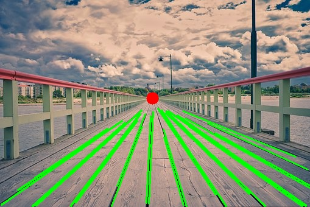

<<<<<<< HEAD
# Vanishing-Point-Estimation
=======
# Vanishing Point Detection

This project detects and visualizes vanishing points in images using computer vision techniques with OpenCV.

## Overview

Vanishing points are the points in an image where parallel lines in 3D space appear to converge. This concept is fundamental in perspective geometry and has applications in computer vision, camera calibration, and scene understanding.



## Features

- Detects straight lines using Hough transform
- Filters lines based on angle to focus on perspective lines
- Computes intersections of the filtered lines
- Estimates vanishing points through averaging intersection points
- Visualizes detected lines and the estimated vanishing point

## Requirements

- C++ compiler with C++17 support
- OpenCV 4.x
- CMake (recommended for building)

### Manual Compilation

```bash
g++ -std=c++17 vanishing_point_detector.cpp -o vanishing_point_detector `pkg-config --cflags --libs opencv4`
```

## Usage

1. Place your input images in a folder named `Estimate_vanishing_points_data`
2. Run the program:

```bash
./vanishing_point_detector
```

3. Results will be saved in the `output_results` folder

## Algorithm Explanation

1. **Preprocessing**: Convert image to grayscale, apply Gaussian blur, detect edges using Canny algorithm
2. **Line Detection**: Use Hough transform to identify straight lines
3. **Line Filtering**: Remove horizontal and vertical lines (keep lines with angles between 20° and 160°)
4. **Intersection Calculation**: Find all intersection points between remaining lines
5. **Vanishing Point Estimation**: Average all valid intersection points to find the vanishing point
6. **Visualization**: Draw the detected lines and vanishing point on the original image

## Applications

- Camera calibration
- 3D scene reconstruction
- Architectural photography analysis
- Autonomous navigation and driving systems
- Augmented reality
>>>>>>> c909536 (Added readme file)
